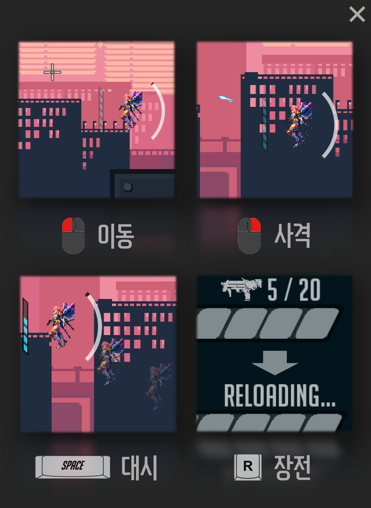

# Slumberland

Slumberland is a 2D physics action game built in Java with Swing and AWT. The project implements its own vector operations, motion update loop, rotated-rectangle collision detection, enemy behavior, boss attack patterns, weapons, and game UI.



## Highlights

- Model-View-Controller separation for game state, input and simulation, and rendering
- Custom 2D vector mathematics for addition, subtraction, scaling, dot products, normalization, normals, and rotation
- Motion simulation using gravity, drag, acceleration, velocity, and position updates
- Separating Axis Theorem collision detection for rotated rectangular colliders
- Minimum Translation Vector calculation for penetration resolution and collision response
- Player systems for jetpack movement, dash, weapon recoil, ammunition, and reload
- Enemy behavior with patrol limits, range checks, burst fire, reload timing, and jumping
- Boss patterns with directional missiles, rotating bullet streams, and radial volleys

## Architecture

```text
Model
  Player, Enemy, Boss, Bullet, Obstacle, Stage and GUI state

Controller
  Input, game loop, physics updates, collision tests and responses

View
  Rendering, camera transforms, effects and GUI composition
```

The main packages are located under `Slumberland/src`:

| Package | Responsibility |
| --- | --- |
| `gameSystem` | Model, View, Controller, game frame and client lifecycle |
| `physicalObject` | Shared physical state and entity hierarchy |
| `collision` | Collider geometry, SAT test and MTV calculation |
| `vector` | Custom 2D vector operations |
| `weapon` | Ammunition, reload timing and weapon behavior |
| `drawable` | Bullets, missiles and visual effects |
| `gui` | Health, weapon, dash, jetpack and boss UI |

## Physics and collision

Each physical object tracks position, velocity, acceleration, mass, angle and collider state. The controller applies forces and updates motion during the game loop.

For collision detection, both rotated rectangles contribute two candidate axes. The engine projects each collider onto all four axes. A separating gap ends the test immediately. When every projection overlaps, the smallest overlap defines the Minimum Translation Vector used to resolve penetration and update velocity.

Relevant files:

- `Slumberland/src/vector/Vector.java`
- `Slumberland/src/collision/Collider.java`
- `Slumberland/src/collision/Collision.java`
- `Slumberland/src/gameSystem/Controller.java`

## Enemy and boss behavior

Regular enemies patrol within local bounds and attack when the player enters range. An attack cycle combines aimed burst fire, reload timing and a jump decision.

The boss runs separate movement and attack loops. Its attack sequence combines fixed-direction missiles with bullet directions generated from `(cos θ, sin θ)`, producing rotating streams and radial patterns.

Relevant files:

- `Slumberland/src/physicalObject/entity/Enemy.java`
- `Slumberland/src/physicalObject/entity/Boss.java`

## Controls

- Move: left mouse button
- Shoot: right mouse button
- Dash: `Space`
- Reload: `R`

## Technology

- Java
- Swing and AWT
- Object-oriented design
- Custom vector and collision mathematics

## Project status

The core game implementation is complete. This repository is retained as a portfolio project demonstrating foundational programming, mathematics, simulation, and game-system design.
